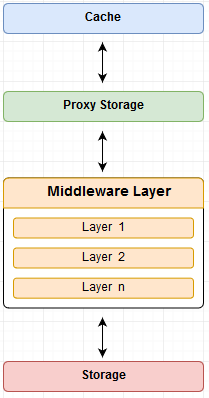
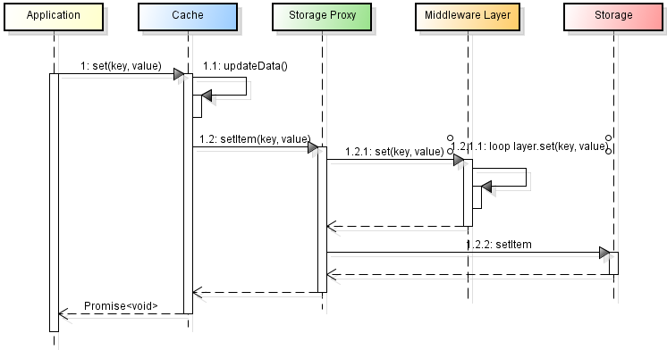
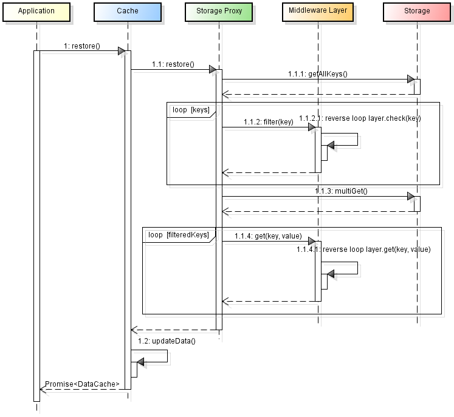

## Architecture



### Cache

The Cache is the component that manages the local cache of the application and the only component with which the application must interface. It exposes synchronous methods when the information to be returned does not require communication with storage, the methods are asynchronous.
It also exposes two methods to allow subscriptions and notification of the cache status.


* **Sync method**

isRehydrated(): boolean; // true if restored

getState(): Readonly<{v[key: string]: any; }>; // return in memory state

toObject(): Readonly<{v[key: string]: any; }>; // return in memory state

get(key: string): any; // get value from in memory state

getAllKeys(): Array<string>; // getAllKeys value from in memory state

* **Async method**

replace(data: any): Promise<void> 

restore(): Promise<Cache>; // restore storage, set rehydratad

purge(): Promise<boolean>; // purge state and storage

clear(): Promise<boolean>; // purge state and storage

set(key: string, value: any): Promise<any>; // set value in state (sync) and in storage (async)

delete(key: string): Promise<any>; // delete value in state (sync) and in storage (async)
    
remove(key: string): Promise<any>; // remove value in state (sync) and in storage (async)

* **Subscriptions and notifications**

subscribe( callback: (message: string, state: any) => void, ): () => void // subscription management

notify(message: string = "notify data"): void // notification of the message and status to all subscriptions


### Storage Proxy

The proxy storage is the intermediary that connects the local cache to the storage.

### Middleware Layer

In the middleware level there are all the transformation and verification logics that are performed during the communication between the cache and the storage.

The layers currently available within the library are:

* **prefixLayer**: layer that handles the key prefix (<prefix>. <originalkey>), is inserted as the first layer when the **prefix option** is different from null 

* **jsonSerialize**:  layer that handles JSON serialization and deserialization of values, is inserted as the last layer when the **serialize option** is true

* **filterKeys**: this layer allows you to define a function to determine which keys persist.


It is possible to implement any other layer component by implementing the interface described below:

```ts
export type ItemCache<T> = {
    key: string,
    value: T
}

export interface Layer<T> {
    set: (key: string, value: T) => ItemCache<T>
    get: (key: string, value: T) => ItemCache<T>
    remove?: (key: string) => string
    check?: (key: string) => boolean
}
```

The main communication flows between the cache and storage are described below to highlight when these layers are used.

* setting flow



* removal flow


* restoring flow



### Storage

Inside the library there is the possibility to use the following storage: 

**localStorage (web default)**

**AsyncStorage (default react-native)**

**sessionStorage**

**IndexedDB**

**nostorage**

If you need to use different storage than those currently provided, simply create a customized storage that implements the following interface:

```ts
export interface Storage {
    multiRemove: (keys: Array<string>) => Promise<void>,
    multiGet: (keys: Array<string>) => Promise<DataCache>,
    getAllKeys: () => Promise<Array<string>>,
    multiSet: (items: Array<ItemCache<any>>) => Promise<void>,
    setItem: (key: string, value: string) => Promise<void>,
    removeItem: (key: string) => Promise<void> 
}
```


## Installation

Install @wora/cache-persist using yarn or npm:

```
yarn add @wora/cache-persist
```

## Cache Options
CacheOptions {
    serialize?: boolean,
    prefix?: string | undefined | null,
    layers?: Array<Layer<any>>,
    storage?: CacheStorage, 
    webStorage?: "local" | "session",
    disablePersist?: boolean
}

storage: custom storage, localStorage is used as the default react web persistence, while AsyncStorage is used for react-native.

prefix: prefix keys, default "cache" (use the prefixLayer)

serialize: if it is true, the data will be serialized and deserialized JSON (use the jsonSerialize)

webStorage: local for localStorage, session for sessionStorage. default local

disablePersist: if it is true, nostorage is used

layers: it is possible to configure which layers to use (eg filerKeys)


## Usage default
```ts
import { Cache } from "@wora/cache-persist";
const cache = new Cache();
cache.restore().then(() => {
    const state = cache.getState();
});
```

## Usage indexedDB

```ts
import Cache, { CacheStorage, CacheOptions } from "@wora/cache-persist";
import IDBStorage from '@wora/cache-persist/lib/idbstorage';

const idbStorages: CacheStorage[] = IDBStorage.create( {
    name: "cache", 
    storeNames: ["persist", "persist2"]
});

const idb: CacheOptions = {
        storage: idbStorages[0],
        serialize: false,
    }

const idb1: CacheOptions = {
        storage: idbStorages[1],
        serialize: false,
    }

const cacheidb = new Cache(idb);
cacheidb.restore().then(() => {
    const state = cacheidb.getState();
});

const cacheidb1 = new Cache(idb1);
cacheidb1.restore().then(() => {
    const state = cacheidb1.getState();
});
```

### Example use filterKeys Layer

```ts
import filterKeys  from '@wora/cache-persist/lib/layers/filterKeys';

const filterPersistAuth: Layer<any> = filterKeys(key => key.includes("auth"));

const filterNoPersistAuth: Layer<any> = filterKeys(key => !key.includes("auth"));

const CacheLocal1 = new Cache({
    layers: [filterNoPersistAuth],
    prefix: 'cache1',
});

const CacheLocal2 = new Cache({
    layers: [filterPersistAuth],
    prefix: 'cache2',
});
```

## Subscribe and notify example with hooks

```ts
import * as React from 'react';
import { useEffect, useState } from 'react';
import { DataCache } from '@wora/cache-persist';

const [result, setResult] = useState<{loading: boolean, data: DataCache}>({loading: true, data: {}});

 useEffect(() => {
    const dispose = cache.subscribe((message, state) => {
      setResult({loading: false, data: state});
    });
    cache.restore().then(() => {
      cache.notify("restored");
    })
    return () => dispose();
    
  },
    []);
```
